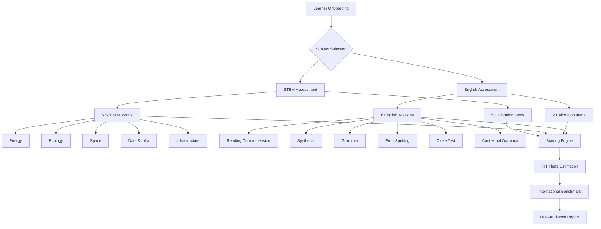
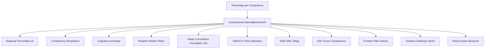
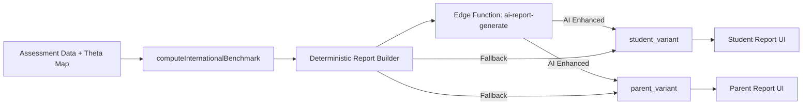
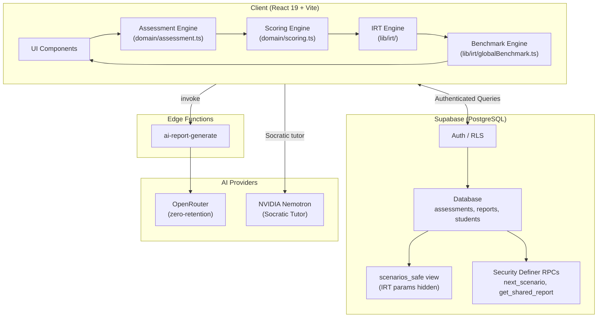
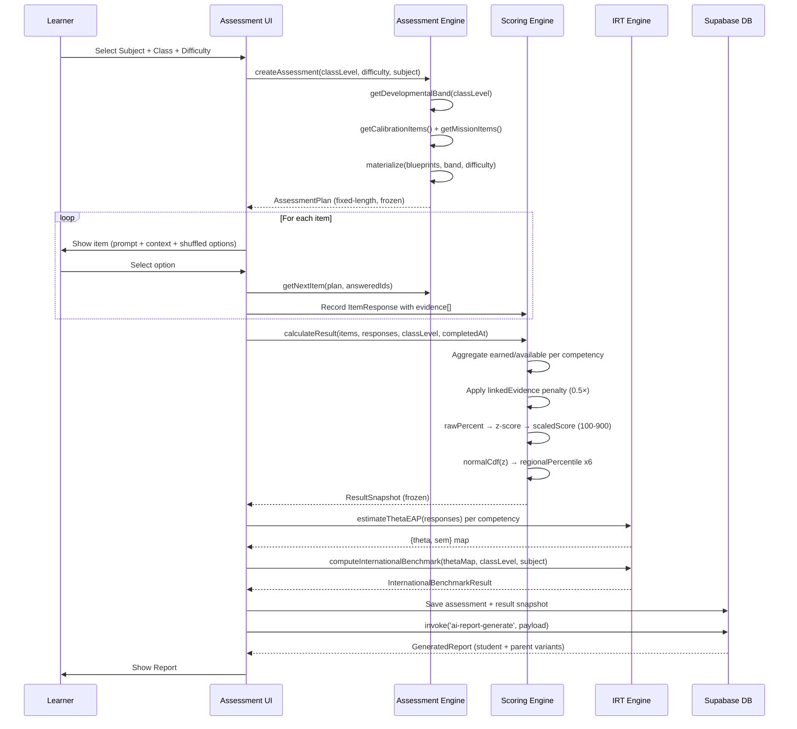
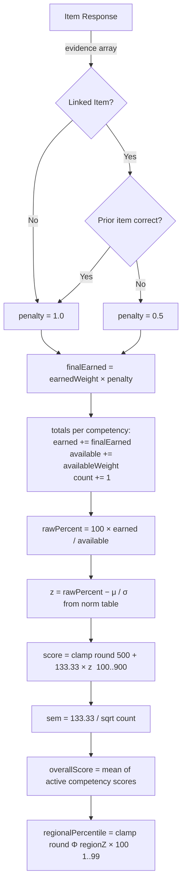
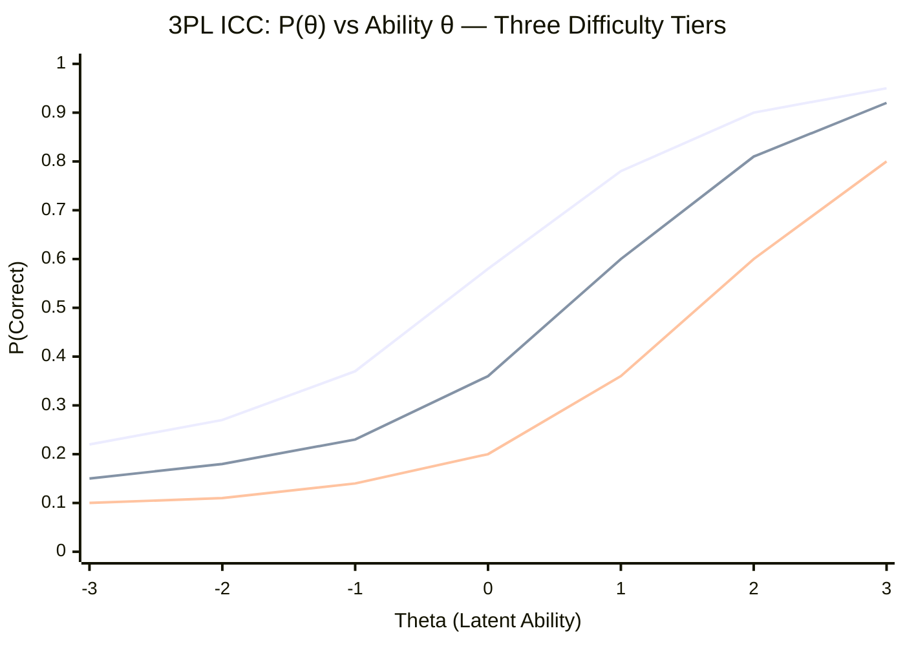

# WARP Assessment Platform — Comprehensive Technical Documentation

> **Version:** Assessment Engine v1 · Norm Version `provisional-2026.08`  
> **Standards Alignment:** NGSS SEP · PISA 2025 · India NCF 2023 · CBSE · JEE/IOQM Foundation  
> **Last Updated:** September 2026

---

## Table of Contents

1. [Platform Overview](#1-platform-overview)
2. [Assessment Subjects & Mission Architecture](#2-assessment-subjects--mission-architecture)
3. [STEM Question Design](#3-stem-question-design)
4. [English Question Design](#4-english-question-design)
5. [International Assessment Alignment](#5-international-assessment-alignment)
6. [Developmental Bands & Curriculum Mapping](#6-developmental-bands--curriculum-mapping)
7. [Difficulty Tiers](#7-difficulty-tiers)
8. [Scoring Architecture](#8-scoring-architecture)
9. [IRT Algorithm & Psychometric Engine](#9-irt-algorithm--psychometric-engine)
10. [International Benchmark Engine](#10-international-benchmark-engine)
11. [AI Report Generation](#11-ai-report-generation)
12. [Security & Data Architecture](#12-security--data-architecture)
13. [Full Feature Inventory](#13-full-feature-inventory)
14. [System Architecture Diagrams](#14-system-architecture-diagrams)

---

## 1. Platform Overview

WARP (World Assessment and Reasoning Platform) is a **psychometric diagnostic instrument** built for students in Classes 3–12. It measures STEAM cognitive competencies using scenario-driven, multi-option assessment items calibrated against international standards from Singapore, China, USA, Europe, and India.

### Core Design Principles

| Principle | Implementation |
|---|---|
| **Psychometric Rigor** | 3-Parameter Logistic IRT with EAP theta estimation |
| **Developmental Sensitivity** | Five developmental bands with rewritten items per band |
| **International Calibration** | Norms aligned to PISA/TIMSS/Olympiad cohorts across 6 regions |
| **Misconception Diagnosis** | Every distractor is tagged with the exact cognitive misconception it surfaces |
| **Dual Audience Reporting** | Student-facing (encouraging, mission-framed) and Parent-facing (analytical, actionable) |
| **Security-First** | Server-authoritative IRT scoring; IRT parameters never exposed to client |
| **Privacy Compliance** | COPPA/DPDP consent gating via Supabase RLS at database level |

### Technology Stack

```
Frontend:    React 19 + Vite + TypeScript
Backend:     Supabase (PostgreSQL + Row-Level Security + Edge Functions)
AI Reports:  OpenRouter (zero-retention providers) + NVIDIA Nemotron
Scoring:     Client-side IRT + Server-authoritative ability estimation
Fonts:       Space Grotesk (display) · Inter (body) · JetBrains Mono (data)
```

---

## 2. Assessment Subjects & Mission Architecture

WARP supports **two subjects**: STEM and English. Each subject runs through an identical pipeline — calibration → missions → scoring → report — but with different item banks, competency domains, and norm sets.



### STEM Mission IDs

| Mission ID | Title | Primary Competencies |
|---|---|---|
| `stem-energy` | Renewable Energy Systems | Engineering Design, Scientific Inquiry |
| `stem-ecology` | Ecological Systems | Systems Thinking, Scientific Inquiry |
| `stem-space` | Space & Astrophysics | Mathematical Reasoning, Scientific Inquiry |
| `stem-data` | Data & Algorithms | Computational Thinking, Mathematical Reasoning |
| `stem-infra` | Infrastructure & Urban Systems | Engineering Design, Systems Thinking |

### English Mission IDs

| Mission ID | Title | Primary Competencies |
|---|---|---|
| `eng-reading-comp-1` | Reading Comprehension | Understanding, Evaluating & Reflecting |
| `eng-synthesis-1` | Multi-Source Synthesis | Synthesis, Understanding |
| `eng-grammar-1` | Grammar Application | Understanding |
| `eng-error-spotting-1` | Error Identification | Understanding, Critical Thinking |
| `eng-cloze-1` | Cloze Completion | Understanding, Locating Information |
| `eng-grammar-reading-1` | Contextual Grammar | Understanding |

---

## 3. STEM Question Design

### 3.1 Competency Domains (STEM)

WARP measures **five STEM competencies**, each mapped to international frameworks:

| Competency | Code | Description | PISA 2025 Alignment | NGSS Alignment |
|---|---|---|---|---|
| **Scientific Inquiry** | `scientificInquiry` | Planning experiments, forming testable hypotheses, isolating variables | C2: Enquiry & data | SEP3: Planning investigations |
| **Computational Thinking** | `computationalThinking` | Algorithmic reasoning, data processing, pattern recognition | C3: Decide with evidence | SEP5: Mathematics & computational thinking |
| **Engineering Design** | `engineeringDesign` | Iterative design, trade-off evaluation, constraint optimization | C1: Explain phenomena | SEP6: Designing solutions |
| **Mathematical Reasoning** | `mathematicalReasoning` | Quantitative analysis, modeling, logical deduction | C3: Decide with evidence | SEP5: Mathematics |
| **Systems Thinking** | `systemsThinking` | Multi-variable causal modeling, feedback loops, second-order effects | C4: Systems & interactions | SEP7: Engaging in argument |

### 3.2 Item Blueprint Architecture

Every STEM item is defined as a **Blueprint** — a single concept expressed across all five developmental bands. This ensures the same competency is assessed at age-appropriate depth from Class 3 through Class 12.

```typescript
interface ItemBlueprint {
  id: string;                          // e.g., 'cal-sci'
  missionId: string;                   // e.g., 'calibration'
  missionTitle: string;
  standards: readonly string[];        // NGSS + PISA + NCF 2023 tags
  state: ScenarioState;                // Scenario context variables
  bands: Record<DevelopmentalBand, ItemVariant>;  // One variant per band
}
```

**Example — `cal-sci` item across bands:**

| Band | Prompt Complexity |
|---|---|
| `3-4` | "The school garden tomato plants are drooping... What should the class test first?" |
| `5-6` | "A community garden's plants are wilting despite regular watering. Which check gives the strongest first clue?" |
| `7-8` | "Which hypothesis is most testable?" |
| `9-10` | "Which investigation best isolates the cause?" (includes osmosis explanation) |
| `11-12` | "Design the decisive first comparison." (market-garden framing, funded remediation context) |

### 3.3 Option Design & Misconception Tagging

Every item has exactly **four options**. Each option is:
- Assigned a **primary competency** and **secondary competency**
- Given a point weight (`earned`) out of 10 for the primary competency
- Optionally tagged with a **canonical misconception** for diagnostics

```typescript
// Example: Scientific Inquiry calibration distractor
o('c2', 'Give the plants twice as much water every day.',
  'scientificInquiry', 'systemsThinking',
  2,                                        // earned: 2/10 (weak response)
  'more water always helps plants'          // misconception tag
)
```

**Full-credit answers** always receive `earned: 10`. Misconception tags are only placed on designed wrong answers to enable targeted diagnostic feedback in reports.

### 3.4 Dual-Competency Evidence

Every option simultaneously contributes evidence to **two competencies**:
- **Primary**: `earned` weight out of 10
- **Secondary**: `max(1, earned - 2)` weight out of 10 (secondary earns slightly less)

This means a single answered item can update the ability estimate for two competencies simultaneously, increasing measurement efficiency.

### 3.5 STEM Scenario State

Each blueprint carries a `ScenarioState` — a dictionary of live variables displayed on the interactive scenario card (e.g., `{ wind: 15 }` for the energy mission, `{ dataSize: 10000 }` for the data mission). This simulates dynamic, real-world STEM contexts.

### 3.6 Deterministic Option Shuffling

To prevent position bias without sacrificing reproducibility, option order is shuffled using the **FNV-1a hash function** seeded with the item ID and developmental band:

```typescript
function seededShuffle<T>(items: readonly T[], seed: string): readonly T[] {
  return items
    .map((value, index) => ({ value, key: fnv1a(`${seed}:${index}`) }))
    .sort((a, b) => a.key - b.key)
    .map(entry => entry.value);
}
```

The same student always sees the same order for a given item — reproducible, but not predictably positional.

---

## 4. English Question Design

### 4.1 Competency Domains (English)

WARP measures **five English competencies** aligned to PISA 2025 Reading Literacy and CBSE/CEFR frameworks:

| Competency | Code | Description | Assessment Framework |
|---|---|---|---|
| **Understanding** | `understanding` | Comprehension of theme, authorial intent, grammar, and main idea | PISA 2025 RL-1: Locating information |
| **Locating Information** | `locatingInformation` | Precise factual extraction from structured text | PISA 2025 RL-1 |
| **Synthesis** | `synthesis` | Integrating information across multiple sources or perspectives | PISA 2025 RL-2 |
| **Evaluating & Reflecting** | `evaluatingReflecting` | Critical analysis of author stance, argument quality, bias | PISA 2025 RL-3 |
| **Critical Thinking** | `criticalThinking` | Cross-cutting reasoning across text and argument structures | CBSE/CEFR C1+ |

### 4.2 English Mission Types

Unlike STEM which uses the blueprint/band system, English items are authored in a flat structure per mission, allowing passage-based, multi-item questioning:

#### Reading Comprehension (`eng-reading-comp-1`)
- Authentic passage excerpts with literary or informational content
- Tests theme identification, authorial intent, and subtext inference
- Options are designed around common misreading patterns (surface detail focus, overgeneralization)

#### Synthesis (`eng-synthesis-1`)
- Multi-source integration tasks
- Learners must combine claims from two or more sources
- Targets PISA RL-2: Integration and Inference

#### Grammar Application (`eng-grammar-1`)
- Sentence-level correction and identification
- Covers tense, subject-verb agreement, pronoun reference, and modifiers

#### Error Spotting (`eng-error-spotting-1`)
- Sentence segmented into labeled parts (A/B/C/D)
- One segment contains a grammatical error; learner must identify it
- "No error" is always a valid option to prevent guessing bias

#### Cloze Test (`eng-cloze-1`)
- Passage with a blank; learner selects the most appropriate word
- Tests contextual vocabulary, collocations, and grammatical fit

#### Contextual Grammar (`eng-grammar-reading-1`)
- Integrated grammar-reading task: short passage + grammar identification
- Example: pronoun reference disambiguation in narrative text

### 4.3 English Calibration Items

Two calibration items run before the main English missions:
1. **Theme Identification** — tests `understanding` via a literary passage about an aqueduct
2. **Factual Retrieval** — tests `locatingInformation` via an archaeological excavation log with dated events

These items establish baseline ability before domain missions begin.

### 4.4 English Misconception Taxonomy

English distractors are engineered around known reading failure modes:

| Misconception | Description | Example Distractor Type |
|---|---|---|
| `surface detail focus` | Student selects a concrete detail rather than inferring the theme | "The economic value of sheep farming" instead of impermanence of civil engineering |
| `present tense` | Fails to apply past tense in a past-time context | Selects "go" instead of "went" |
| `incomplete continuous tense` | Uses -ing form without auxiliary | Selects "going" instead of "went" |
| `past participle without auxiliary` | Uses past participle alone | Selects "gone" instead of "went" |
| `confusing subject with object` | Pronoun resolution error | Selects "the bird" for a pronoun that refers to "the worm" |
| `selected initial construction date` | Time confusion in sequential data | Selects 120 CE (construction) instead of 340 CE (decommission) |

---

## 5. International Assessment Alignment

WARP is calibrated against the world's most rigorous student assessment frameworks:

### 5.1 NGSS (Next Generation Science Standards) — USA

All STEM items carry NGSS Science & Engineering Practices (SEP) tags:

| NGSS SEP | Code | WARP Competency |
|---|---|---|
| SEP3: Planning & Carrying Out Investigations | `SEP3` | Scientific Inquiry |
| SEP5: Using Mathematics and Computational Thinking | `SEP5` | Computational Thinking, Mathematical Reasoning |
| SEP6: Constructing Explanations and Designing Solutions | `SEP6` | Engineering Design |
| SEP7: Engaging in Argument from Evidence | `SEP7` | Systems Thinking |

### 5.2 PISA 2025 Competency Framework

PISA 2025 competency codes are embedded in every item's `standards[]` array:

| PISA 2025 Code | Description | WARP Mapping |
|---|---|---|
| C1: Explain phenomena | Interpret and describe phenomena scientifically | Engineering Design, Scientific Inquiry |
| C2: Enquiry & data | Design experiments, analyze evidence | Scientific Inquiry |
| C3: Decide with evidence | Use data to evaluate claims and solutions | Computational Thinking, Mathematical Reasoning |
| C4: Systems & interactions | Model complex causal chains | Systems Thinking |
| RL-1: Locate information | Find and extract facts from text | Locating Information |
| RL-2: Integrate & infer | Cross-text synthesis and inference | Synthesis |
| RL-3: Evaluate & reflect | Critically assess text quality and intent | Evaluating & Reflecting |

### 5.3 India NCF 2023 (National Curriculum Framework)

Every developmental band maps to India's 5+3+3+4 school structure:

| Band | NCF 2023 Stage | School Phase |
|---|---|---|
| `3-4` | NCF 2023 Preparatory | Preparatory (Classes 3–5) |
| `5-6` | NCF 2023 Preparatory-Middle | Preparatory/Middle transition |
| `7-8` | NCF 2023 Middle | Middle (Classes 6–8) |
| `9-10` | NCF 2023 Secondary | Secondary (Classes 9–10) |
| `11-12` | NCF 2023 Higher Secondary | Senior Secondary (Classes 11–12) |

### 5.4 Regional Benchmark Reference Standards

WARP's international norm engine is calibrated against these reference cohorts:

| Region | STEM Reference | English Reference |
|---|---|---|
| **Singapore** | SASMO, PSLE, O-Levels, National Olympiad in Informatics | MOE O-Level English, General Paper |
| **China** | CMO (Chinese Mathematical Olympiad), NOIP, Gaokao Foundation | Gaokao English reading |
| **USA** | AMC 8/10/12, USACO, NGSS, AP Computer Science | SAT/ACT, AP English Language |
| **Europe** | Bebras (Computational), Kangaroo Math, PISA Top-Decile (Finland/Estonia) | CEFR C1/C2, Cambridge English |
| **India** | IOQM, JEE Advanced Foundation, INJSO, ZIO | CBSE/ICSE English Core |
| **Global** | PISA/TIMSS International Median | PISA Reading Literacy Median |

---

## 6. Developmental Bands & Curriculum Mapping

### 6.1 Band System

Every item has five variants — one per **Developmental Band**. The band is derived from the student's class level at onboarding:

```typescript
function getDevelopmentalBand(classLevel: number): DevelopmentalBand {
  if (classLevel >= 3 && classLevel <= 4) return '3-4';
  if (classLevel >= 5 && classLevel <= 6) return '5-6';
  if (classLevel >= 7 && classLevel <= 8) return '7-8';
  if (classLevel >= 9 && classLevel <= 10) return '9-10';
  if (classLevel >= 11 && classLevel <= 12) return '11-12';
  throw new Error(`Class ${classLevel} is outside WARP's Class 3-12 range.`);
}
```

### 6.2 Band-Level Cognitive Expectations

Each band carries a different **cognitive instruction** prepended to every prompt, which sets the metacognitive frame for the learner:

| Band | Instruction Prompt |
|---|---|
| `3-4` | *"Use what you can see and choose the safest next step."* |
| `5-6` | *"Use the evidence to compare what could happen next."* |
| `7-8` | *"Trace how a local decision affects linked parts of the system."* |
| `9-10` | *"Evaluate the trade-offs, constraints, and feedback effects before deciding."* |
| `11-12` | *"Model the uncertainty, dependencies, and second-order effects before deciding."* |

This ladder represents increasing **cognitive load** and **abstraction level**, consistent with Bloom's Taxonomy and SOLO (Structure of Observed Learning Outcomes) progressions.

---

## 7. Difficulty Tiers

### 7.1 Three-Tier System

WARP supports three difficulty tiers selected during learner onboarding:

| Tier | IRT b-parameter | Time/Question | Use Case |
|---|---|---|---|
| **Standard** | b = −0.5 | 90 seconds | Baseline diagnostic; CBSE/NCERT parity |
| **Advanced** | b = +0.5 | 120 seconds | Competitive exam readiness |
| **Olympiad** | b = +1.5 | 150 seconds | International competition preparation |

### 7.2 Difficulty Scaling on Distractor Weights

The difficulty tier compresses distractor earned-weights **upward**, making wrong answers harder to distinguish from the correct one. This is the psychometric mechanism for increasing perceived difficulty:

```typescript
function scaleDifficulty(earned: number, available: number, difficulty: Difficulty): number {
  if (difficulty === 'Standard') return earned;
  if (earned >= available) return available;  // correct answer always stays at maximum
  
  const floor = difficulty === 'Advanced' ? 3 : 6;
  return Math.round(floor + (earned / available) * (available - floor - 1));
}
```

**Concrete example for an item with weights [0, 2, 4, 10]:**

| Option | Standard | Advanced | Olympiad |
|---|---|---|---|
| Weakest distractor | 0 | 3 | 6 |
| Moderate distractor | 2 | 4 | 7 |
| Strong distractor | 4 | 5 | 8 |
| Correct answer | 10 | 10 | 10 |

At **Olympiad** level, even wrong answers earn 6–8 points, making the discrimination between options extremely subtle — requiring deep conceptual understanding rather than elimination of obvious errors.

### 7.3 Time Limits

Time limits are computed proportionally: `total_items × seconds_per_question × 1000` (milliseconds).

For a typical 30-item assessment:
- **Standard**: 30 × 90s = **45 minutes**
- **Advanced**: 30 × 120s = **60 minutes**
- **Olympiad**: 30 × 150s = **75 minutes**

---

## 8. Scoring Architecture

### 8.1 Pipeline Overview


### 8.2 Evidence Aggregation

For each answered item, the scoring engine extracts **EvidenceContributions** — the earned and available weights per competency:

```typescript
for (const contribution of response.evidence) {
  const finalEarned = contribution.earnedWeight * dependencyPenalty;
  totals[contribution.competency].earned  += finalEarned;
  totals[contribution.competency].available += contribution.availableWeight;
  totals[contribution.competency].count += 1;
}
```

### 8.3 Linked Evidence Penalty

Multi-part questions use **linked evidence items**. If a student did not answer the prerequisite evidence item correctly, a `0.5×` penalty is applied to the dependent item's earned weight:

```typescript
let dependencyPenalty = 1.0;
if (item.linkedEvidenceItemId) {
  const evidenceResponse = responses.find(r => r.itemId === item.linkedEvidenceItemId);
  const evidenceCorrect = evidenceResponse?.correct === true;
  if (!evidenceCorrect) {
    dependencyPenalty = 0.5;  // Halved weight for dependent items
  }
}
```

### 8.4 Raw Percent to Scaled Score

**Step 1 — Raw Percent:**
$$\text{rawPercent}_c = \frac{100 \times \sum \text{earned}_c}{\sum \text{available}_c}$$

**Step 2 — Z-Score against Class Norm:**
$$z_c = \frac{\text{rawPercent}_c - \mu_c}{\sigma_c}$$

Where $\mu_c$ and $\sigma_c$ are the class-level mean and standard deviation from the WARP provisional norm table.

**Step 3 — Scaled Score (100–900 scale):**
$$\text{score}_c = \text{clamp}\left(\text{round}(500 + 133.33 \times z_c),\; 100,\; 900\right)$$

This is a linear transformation placing the global mean at **500** with a standard deviation of **133 points** — analogous to SAT/GRE scaling.

**Step 4 — Standard Error of Measurement:**
$$\text{SEM}_c = \frac{133.33}{\sqrt{\max(1, n_c)}}$$

Where $n_c$ is the number of items answered for that competency. SEM decreases as more items are answered.

### 8.5 Overall Score

The overall score is the **arithmetic mean** of all active competency scaled scores:

$$\text{overallScore} = \frac{1}{|\mathcal{A}|}\sum_{c \in \mathcal{A}} \text{score}_c$$

Where $\mathcal{A}$ is the set of assessed (active) competencies.

### 8.6 Norm System

WARP maintains **provisional-2026.08** norms for every class level (3–12) and every competency. Norms increase with class level, reflecting curriculum progression:

| Class | Scientific Inquiry (mean, σ) | Mathematical Reasoning (mean, σ) | Critical Thinking (mean, σ) |
|---|---|---|---|
| 3 | 52.0, 13.0 | 51.0, 13.0 | 43.0, 18.0 |
| 6 | 56.0, 12.0 | 55.0, 13.0 | 46.0, 18.0 |
| 9 | 61.0, 12.0 | 61.0, 12.0 | 50.0, 18.0 |
| 12 | 67.0, 11.0 | 67.0, 11.0 | 55.0, 18.0 |

**Note**: Critical Thinking has a lower mean (43–55) and higher standard deviation (18) across all classes, reflecting its cross-cutting nature and higher variance in student ability.

### 8.7 Regional Norm Offsets

The global norms are adjusted per region using offset tables. Regional means shift to reflect that populations in different countries demonstrate different average performance levels:

| Region | Understanding Offset | Math Reasoning Offset | Critical Thinking Offset |
|---|---|---|---|
| Singapore | +8 | +8 | +7 |
| China | +5 | +5 | +4 |
| USA | +2 | +3 | +3 |
| Europe | +2 | +2 | +2 |
| India | 0 | 0 | −4 |
| Global | 0 | 0 | 0 |

### 8.8 Regional Percentile Calculation

For each region, the engine:
1. Computes the region-adjusted norm (mean + offset, same σ)
2. Calculates the student's region-specific z-score
3. Converts to a percentile using the Normal CDF (Abramowitz & Stegun approximation)

$$\text{percentile}_r = \text{clamp}\left(\text{round}(\Phi(z_r) \times 100),\; 1,\; 99\right)$$

---

## 9. IRT Algorithm & Psychometric Engine

### 9.1 The 3-Parameter Logistic (3PL) Model

WARP uses the **3-Parameter Logistic IRT model** to model the probability of a correct response given a student's latent ability $\theta$:

$$P(\theta) = c + \frac{1 - c}{1 + e^{-a(\theta - b)}}$$

**Parameters:**

| Parameter | Symbol | Range | Meaning |
|---|---|---|---|
| Discrimination | $a$ | 0.5–2.5 | Steepness of the ICC curve; higher = more discriminating |
| Difficulty | $b$ | −3.0 to +3.0 | Point where $P = 0.5 + c/2$; Standard=−0.5, Advanced=+0.5, Olympiad=+1.5 |
| Guessing | $c$ | 0.0–0.25 | Lower asymptote; probability of correct response at very low ability |

> [!IMPORTANT]
> The guessing parameter $c$ applies as a **lower asymptote**, scaling the logistic curve **outside** the exponential. Never place $c$ inside the logit — this is a common implementation flaw.

```typescript
// Correct 3PL implementation
const p = r.c + (1 - r.c) / (1 + Math.exp(-r.a * (theta - r.b)));
```

### 9.2 Expected A Posteriori (EAP) Theta Estimation

WARP uses **Bayesian EAP estimation** with a standard normal prior $N(0,1)$ over 41 quadrature nodes from $\theta = -4$ to $\theta = +4$:

$$\hat{\theta}_{EAP} = \frac{\displaystyle\sum_{k} X_k \cdot L(X_k) \cdot W_k}{\displaystyle\sum_{k} L(X_k) \cdot W_k}$$

$$\text{SEM}(\hat{\theta}) = \sqrt{\frac{\displaystyle\sum_{k} (X_k - \hat{\theta}_{EAP})^2 \cdot L(X_k) \cdot W_k}{\displaystyle\sum_{k} L(X_k) \cdot W_k}}$$

Where:
- $X_k$ = quadrature node (grid point from −4 to +4 in steps of 0.2)
- $W_k = e^{-0.5 X_k^2}$ = standard normal weight (unnormalized prior)
- $L(X_k)$ = joint likelihood of response pattern at node $k$

```typescript
export function estimateThetaEAP(responses: IRTResponse[]): EAPResult {
  const nodes: number[] = [];
  const weights: number[] = [];
  
  // 41 nodes from -4 to 4 (step 0.2)
  for (let i = -20; i <= 20; i++) {
    const x = i * 0.2;
    nodes.push(x);
    weights.push(Math.exp(-0.5 * x * x));  // N(0,1) prior
  }
  
  let numer = 0, denom = 0;
  nodes.forEach((theta, i) => {
    let likelihood = 1;
    for (const r of responses) {
      const p = r.c + (1 - r.c) / (1 + Math.exp(-r.a * (theta - r.b)));
      likelihood *= r.correct ? p : (1 - p);
    }
    numer += theta * likelihood * weights[i];
    denom += likelihood * weights[i];
  });
  
  const thetaEAP = denom === 0 ? 0 : numer / denom;
  // SEM computed from posterior variance...
  return { theta: thetaEAP, sem };
}
```

### 9.3 Theta to Score Transformation

Two transformations are used to make theta human-readable:

**Scaled Score (100–900):**
$$\text{scaledScore} = \text{clamp}(\text{round}(500 + 133.33 \times \theta),\; 100,\; 900)$$

**Radar Index (0–100 for visual display):**
$$\text{radarIndex} = \text{clamp}(\text{round}(50 + 18 \times \theta),\; 5,\; 99)$$

### 9.4 Item Pool Requirements

For Computerized Adaptive Testing (CAT) readiness, WARP requires:

| Requirement | Value |
|---|---|
| Minimum items per competency per band | 12–15 |
| Total items for 5 competencies × 5 bands | ~300 calibrated items |
| SEM displayed alongside $\theta$ | Always required in analytical reports |

### 9.5 Server-Side Security (Anti-Cheat)

The IRT $b$-parameters are embedded in client-side items only for the current assessment plan. In the full Supabase production path:

- Raw `public.scenarios` table (with IRT parameters $a, b, c$) is **accessible only to service roles**
- Clients query `public.scenarios_safe` — a view that **omits** `irt_a`, `irt_b`, `irt_c`
- Ability $\theta$ is **never supplied by the client** when requesting the next item; the server reads it directly from the `assessments` record
- All theta updates are written exclusively by service-role background functions

---

## 10. International Benchmark Engine

### 10.1 Architecture

The international benchmark engine (`globalBenchmark.ts`) is a comprehensive psychometric module (~77KB) that computes a complete diagnostic profile against 6 regional cohorts.



### 10.2 Regional Norms (Latent Theta Scale)

Regional norms are specified as latent ability distributions $\theta \sim N(\mu, \sigma)$:

| Region | STEM Mean θ | σ | Calibration Source |
|---|---|---|---|
| Singapore | 0.74 | 0.81 | SASMO, O-Level, MOE |
| China | 0.75 | 0.79 | CMO, Gaokao, NOIP |
| USA | 0.53 | 0.97 | AMC, NGSS, AP Comp Sci |
| Europe | 0.58 | 0.89 | Bebras, Kangaroo, PISA Top-Decile |
| India | 0.41 | 1.06 | IOQM, CBSE, JEE Foundation |
| Global | 0.00 | 1.00 | PISA/TIMSS median |

### 10.3 Cognitive Archetypes

The system assigns a **Cognitive Archetype** based on the pattern of theta values across competencies. For STEM:

| Archetype | Trigger Condition | Primary Strength | Critical Blindspot |
|---|---|---|---|
| Computational Virtuoso | `computationalThinking ≥ 0.8` & `mathematicalReasoning ≥ 0.8` | Algorithmic design | Systemic context |
| Scientific Pioneer | `scientificInquiry ≥ 0.8` & `systemsThinking ≥ 0.7` | Experimental rigor | Mathematical formalism |
| Engineering Innovator | `engineeringDesign ≥ 0.8` & `computationalThinking ≥ 0.7` | Applied design | Theoretical modeling |
| Systems Architect | `systemsThinking ≥ 0.9` & `engineeringDesign ≥ 0.7` | Multi-variable modeling | Experimental validation |
| Emerging STEM Foundation | `avgTheta ≤ −0.6` | Effort and engagement | All competencies need structured support |

For English:

| Archetype | Trigger Condition | Primary Strength | Critical Blindspot |
|---|---|---|---|
| Critical Text Synthesizer | `synthesis ≥ 0.8` & `evaluatingReflecting ≥ 0.7` | Cross-document synthesis | Overcomplicates direct factual retrieval |
| Analytical Close Reader | `understanding ≥ 0.8` & `locatingInformation ≥ 0.8` | Evidence citation precision | Conflicting perspectives |
| Emerging Text Explorer | `understanding < 0.2` & `locatingInformation < 0.2` | Fast initial impression | Keyword trap vulnerability |
| Emerging Foundational Reader | `avgTheta ≤ −0.6` | Willingness to engage | Severe distractor susceptibility |

### 10.4 Multi-Framework Report Dimensions

The benchmark engine outputs data for **9 distinct reporting frameworks**:

| Framework | Output |
|---|---|
| **Board Grade Band** | Equivalent grade band, school marks correlation (e.g., "A1 / Outstanding") |
| **Paraksh Holistic Pillars** | Conceptual Knowledge, Application & Problem Solving, Higher-Order Thinking |
| **Indian Competitive Foundation** | Tier badge (Foundation / Developing / Competitive / Elite) |
| **UNESCO SDG 4 Indicators** | Tier 1 Foundation, Tier 2 Application, Tier 3 Innovation |
| **IEEE-MDL Stage** | Acclimation / Competency / Proficiency / Mastery |
| **NSF Score Comparisons** | TIMSS-equivalent, Singapore benchmark, OECD Top-Decile delta |
| **Frontier Pillar Indices** | AI & Data Literacy, Robotics & Automation, XR & Simulation, Smart Systems |
| **4-Week Student Sprint** | Week-by-week learning missions |
| **Parent Action Blueprint** | Home routines, curriculum recommendations, PTM discussion guide |

---

## 11. AI Report Generation

### 11.1 Dual-Audience Report Architecture

WARP generates **two distinct reports** from the same assessment data:



### 11.2 Student Variant

| Field | Description |
|---|---|
| `archetypeTitle` | Cognitive archetype (e.g., "Computational Virtuoso") |
| `archetypeTagline` | One-line behavioral descriptor |
| `summary` | Narrative summary using mission-framed language |
| `keyStrengths` | Top 3 competency strengths with specific evidence |
| `blindspots` | Identified cognitive gaps |
| `nextMission` | Recommended next learning challenge |
| `sprint` | 4-week learning plan with weekly focus areas |

The student report uses **encouraging, mission-framed language** — no raw scores, percentiles presented as achievements, not deficits.

### 11.3 Parent Variant

| Field | Description |
|---|---|
| `overallAssessment` | Analytical summary with honest gap analysis |
| `realityCheckSummary` | Comparison to international standards, flagging grade inflation |
| `internationalGapSummary` | Specific sigma gaps vs Singapore benchmark |
| `gradeInflationWarning` | Warning if school marks vs WARP score diverge significantly |
| `actionPlan` | Structured action items with estimated durations |
| `recommendedCurricula` | Specific courses/platforms with purpose descriptions |
| `indianRecommendedCurricula` | India-specific resources (FIITJEE, Khan Academy India, Vedantu) |
| `ptmDiscussionGuide` | Questions to ask the teacher at PTM (Parent-Teacher Meeting) |
| `streamOrientation` | Recommended stream for Class 9–12 (Science/Commerce/Arts + subject focus) |

### 11.4 AI Generation with Deterministic Fallback

The system always runs a **deterministic psychometric report** first (zero latency). If the Edge Function is available, it enhances the report with AI-generated narrative. If the Edge Function fails, the deterministic report is served:

```typescript
async function createAndSaveReport(assessmentId, studentId, ...): Promise<GeneratedReport> {
  // Step 1: Always run deterministic benchmark (instant)
  const benchmark = computeInternationalBenchmark(thetaMap, classLevel, subject);
  const deterministicReport = buildDeterministicReport(studentName, classLevel, benchmark, subject);
  
  // Step 2: Try AI enhancement via Edge Function
  try {
    const edgeFunctionResponse = await supabase.functions.invoke('ai-report-generate', {...});
    return mergeWithBenchmark(edgeFunctionResponse, benchmark);
  } catch {
    // Step 3: Fall back to deterministic report
    return deterministicReport;
  }
}
```

### 11.5 AI Provenance & Zero-Retention

- Reports are generated via **OpenRouter** using zero-retention providers (no training on user data)
- AI model metadata (model name, token usage) is stored alongside reports for transparent provenance
- Socratic tutoring sessions use **NVIDIA Nemotron** (`nvidia/llama-3.1-nemotron-ultra-253b-v1`)

---

## 12. Security & Data Architecture

### 12.1 Non-Enumerable Share Tokens

Report sharing uses a **Security Definer RPC** instead of an open RLS policy, preventing anonymous enumeration of all active reports:

```sql
CREATE OR REPLACE FUNCTION public.get_shared_report(p_token text)
RETURNS SETOF public.reports 
LANGUAGE sql SECURITY DEFINER STABLE
SET search_path = public AS $$
  SELECT * FROM public.reports
  WHERE share_token = p_token
    AND (share_expires_at IS NULL OR share_expires_at > now());
$$;

REVOKE ALL ON FUNCTION public.get_shared_report(text) FROM public;
GRANT EXECUTE ON FUNCTION public.get_shared_report(text) TO anon, authenticated;
```

### 12.2 Parent Consent Gating (COPPA/DPDP)

All data operations on student records are gated by `consent_status = 'verified'` at the database level:

```sql
CREATE POLICY "student assessments select" ON public.assessments
  FOR SELECT USING (
    auth.uid() = student_id 
    AND EXISTS (
      SELECT 1 FROM public.students s 
      WHERE s.id = auth.uid() 
        AND s.consent_status = 'verified'
    )
  );
```

### 12.3 IRT Parameter Protection

The full scenarios table (with $a$, $b$, $c$ parameters) is never exposed to the client:

```sql
-- Public view strips IRT parameters
CREATE VIEW public.scenarios_safe AS
  SELECT id, missionId, prompt, context, hint, options, standards
  -- Deliberately omits: irt_a, irt_b, irt_c
  FROM public.scenarios;

-- Direct access to raw table is service-role only
REVOKE SELECT ON public.scenarios FROM anon, authenticated;
```

### 12.4 Server-Authoritative Scoring

The server always reads $\theta$ directly from the database — clients cannot supply their own ability estimate:

```sql
CREATE OR REPLACE FUNCTION public.next_scenario(p_assessment_id uuid)
RETURNS SETOF public.scenarios_safe 
LANGUAGE plpgsql SECURITY DEFINER AS $$
DECLARE
  v_theta float;
BEGIN
  -- Theta comes from DB, never from client
  SELECT ability_theta INTO v_theta 
  FROM public.assessments WHERE id = p_assessment_id;
  
  RETURN QUERY SELECT * FROM public.scenarios_safe ...;
END;
$$;
```

---

## 13. Full Feature Inventory

### 13.1 Assessment Engine Features

| Feature | Status | Notes |
|---|---|---|
| STEM Assessment | ✅ Live | 5 missions, 5 calibration items |
| English Assessment | ✅ Live | 6 missions, 2 calibration items |
| Developmental Band Routing | ✅ Live | 5 bands, Classes 3–12 |
| Three Difficulty Tiers | ✅ Live | Standard / Advanced / Olympiad |
| Misconception Tagging | ✅ Live | Per distractor, all items |
| Deterministic Option Shuffling | ✅ Live | FNV-1a hash per item+band |
| Linked Evidence Penalty | ✅ Live | 0.5× penalty for multi-part items |
| Undo Last Response | ✅ Live | Within active assessment |
| Timer with Persistence | ✅ Live | Survives page reloads |

### 13.2 Scoring & Psychometrics

| Feature | Status | Notes |
|---|---|---|
| 3PL IRT Model | ✅ Live | a, b, c parameters per item |
| EAP Theta Estimation | ✅ Live | 41-node quadrature, N(0,1) prior |
| Competency Scaled Score (100–900) | ✅ Live | Mean 500, SD 133 |
| SEM Display | ✅ Live | Per competency in reports |
| Regional Percentiles (6 regions) | ✅ Live | India, Singapore, China, USA, Europe, Global |
| Class-Level Norms | ✅ Live | Per class (3–12), per competency |
| Regional Norm Offsets | ✅ Live | Per region, per competency |
| Cognitive Archetype Classification | ✅ Live | STEM & English archetypes |

### 13.3 International Benchmark Engine

| Framework | Status |
|---|---|
| PISA 2025 competency mapping | ✅ Live |
| NGSS SEP standards tags | ✅ Live |
| NCF 2023 stage mapping | ✅ Live |
| Board Grade Band equivalence | ✅ Live |
| Paraksh Holistic Pillars | ✅ Live |
| Indian Competitive Foundation Tier | ✅ Live |
| UNESCO SDG 4 Indicators | ✅ Live |
| IEEE-MDL Stage | ✅ Live |
| NSF Score Comparisons | ✅ Live |
| Frontier Pillar Indices (AI, Robotics, XR, Systems) | ✅ Live |

### 13.4 Reporting Features

| Feature | Status | Notes |
|---|---|---|
| Student Variant Report | ✅ Live | Archetype, mission-framed |
| Parent Variant Report | ✅ Live | Analytical, PTM guide |
| 4-Tab Report IA (Overview / Gaps / Plan / Progress) | ✅ Live | — |
| Scenario Audit Trail | ✅ Live | Full item response log |
| Trajectory Arc View | ✅ Live | Multi-assessment progression |
| Paraksh Radar Chart | ✅ Live | India-specific framework |
| CompetencyChart (spider/bar) | ✅ Live | — |
| One-Page Print Summary | ✅ Live | PDF export |
| Comprehensive Print Dossier | ✅ Live | Full multi-page PDF |
| PDF Export | ✅ Live | Print-optimized layout |
| Public Share Link | ✅ Live | Non-enumerable token |
| AI Socratic Tutor (Nemotron) | ✅ Live | Per-scenario deep drill |
| AI Report Streaming | ✅ Live | `useReportStream` hook |

### 13.5 User & Session Features

| Feature | Status | Notes |
|---|---|---|
| Supabase Authentication | ✅ Live | Email + social providers |
| Parent Consent Gating (COPPA/DPDP) | ✅ Live | DB-enforced RLS |
| Learner Profile (name, class, difficulty, school) | ✅ Live | — |
| Session State Persistence | ✅ Live | Across page reloads |
| Session Phase Machine | ✅ Live | landing→onboarding→hub→assessment→results |
| Dashboard with History | ✅ Live | All past assessments |
| Admin Panel | ✅ Live | `/src/components/admin/` |
| Profile Panel | ✅ Live | Student + parent views |
| Resource Recommendations (DB-driven) | ✅ Live | Per-competency study links |
| Cohort Norms (DB-driven) | ✅ Live | Real-time norm updates |

### 13.6 UI & UX Features

| Feature | Status |
|---|---|
| Nordic Lagom Design System | ✅ Live |
| Light + Dark Mode (Mineral Paper / Twilight Slate) | ✅ Live |
| Sharp 0px Geometry (no rounded corners) | ✅ Live |
| Space Grotesk + Inter + JetBrains Mono typography | ✅ Live |
| Fjord Cyan accent system | ✅ Live |
| STEM City Canvas (interactive city visualization) | ✅ Live |
| Glade Canvas (ecological visualization) | ✅ Live |
| Cinematic Hero landing | ✅ Live |
| Brain Loading animation | ✅ Live |
| Assessment Tutorial | ✅ Live |
| Marketing Pages (per subject) | ✅ Live |
| MathJax SVG Rendering | ✅ Live |

---

## 14. System Architecture Diagrams

### 14.1 Overall System Architecture



### 14.2 Assessment Flow



### 14.3 Scoring Pipeline Detail



### 14.4 IRT Model Visualization



*Lines represent Standard (b=−0.5), Advanced (b=+0.5), and Olympiad (b=+1.5) difficulty tiers with c=0.15, a=1.2.*

---

> [!NOTE]
> All norms in WARP are marked `provisional-2026.08`. A full psychometric calibration study with a nationally representative student sample is required before these norms are finalized for high-stakes reporting. Current norms are based on expected performance distributions from international curriculum documentation and pre-pilot expert calibration.

> [!TIP]
> For the CAT (Computerized Adaptive Testing) roadmap: expand the item pool to ≥300 calibrated items (12–15 per competency per band), then replace the current fixed-length plan (`createAssessment`) with a server-side adaptive next-item selection function that chooses items to minimize SEM given the current θ estimate.
